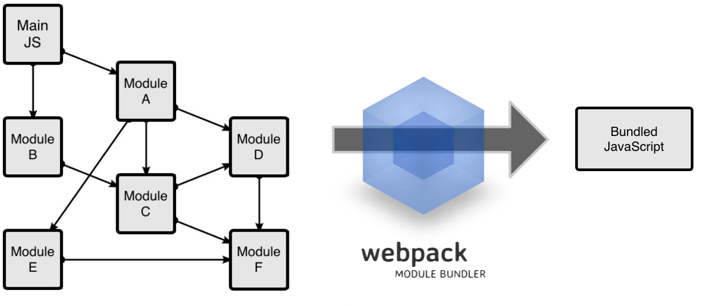
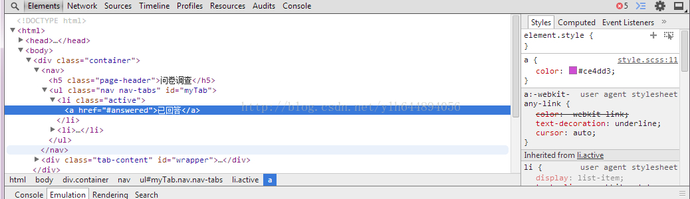

# Webpack
`2017-02-16公司前端技术分享`

## 什么是Webpack
回顾2016这一年来前端技术的发展真的可以用百（gui）花（quan）争（zhen）鸣（luan）来形容，而webpack毫无疑问是这年最火的前端自动化构建工具。
而这个火主要得感谢Facebook的React爸爸在官网告诉大家webpack是亲儿子的事。

[2016年前端开发者深度调研报告表明](http://www.open-open.com/lib/view/open1480648688275.html)

| 模块化合并工具 | 投票票数       | 投票票数(%)  |  与2015年差异 |
| ------------- |:-------------:| -----:|-----:|
| 不使用合并工具  | 1516   |  32.15%  |-21.75%|
| RequireJS    | 359    |   7.61%  | -5.85%|
| Browserify   | 510    |  10.82%  | -5.65%|
| Webpack      | 1962   | 	41.61% |+31.11%|
| Rollup       | 79     |  1.68%   | N/A   |
| JSPM         | 108    |  2.29%   | +0.07%|
| 其他          | 181   |   3.84%  | +0.39% |

有接近50%的使用者愿意使用Webpack进行模块打包，逐步蚕食了Browserify与RequireJS的份额。而从整个模块打包的角度来看，
使用模块打包工具的前端开发者与去年相比已经有了20%的增长。
从我的角度来看，使用某个合适的模块打包工具来处理JavaScript模块依赖问题是成为专业JavaScript开发者不可避免的一个技能

## 为什么要使用它
WebPack可以看做是模块打包机：它做的事情是，分析你的项目结构，使用模块化定制配置的方式对
前端如javascript、html、css、图片、字体图标、模板等静态资源实现转换、合并、打包、部署
等一系列开发/发布方案。

webpack代码截取
```javascript
    ...
    module:{
        loaders:[
            {
                /* 解析less通过postcss管理最终转换成style */
                test:/\.less/,
                loader:'style!css!postcss!less',
            },
            {
                /* 解析less并转换成style */
                test:/\.png$/,loader:'url-loader?limit=10000'
            }
        ]
    },
    plugins:[
        /* 压缩JS */
        new webpack.optimize.UglifyJsPlugin({
             compress: {
                warnings: false
             }
        }),
    ]
    ...
```
## 类比其他类似工具
1. requirejs实现模块化、按需加载, 第一版的github创建是在2010年的2月，里程碑的模块化工具。我们最初angular的产品也使用过它。
但是requirejs归根结底只是提供了JS包的管理方式，并没有针对web前端其他方面做相关支持和管理。而且配置起来<b>太繁琐</b>。
以为这样就完了？模块化异步加载由于队列请求N个JS文件会堵塞页面的，所以发布时还得合并，这个时候需要gulp、grunt等工具。

2. 一句话：自动化。对于需要反复重复的任务，例如压缩（minification）、编译、单元测试、linting等，自动化工具可以减轻你的劳动，简化你的工作。
当你在 Gruntfile 文件正确配置好了任务，任务运行器就会自动帮你或你的小组完成大部分无聊的工作。但是写法以JS代码配置为主，由于写法过于繁琐，需要阅读
好API文档，很快就被gulp取代了。

3. gulp很给力，grunt的替代品，在很短时间内gulp在github的星星数已达25k（grunt 11k），且社区开源插件也更为完善。
在日常开发的流程中，一旦发现恶心重复的操作基本上都可以用gulp来解决。gulp在很大程度上能处理任何语言上
关于文件操作的日常操作。这是优势也是劣势，正因为什么都能做导致gulp插件过于颗粒化，针对前端定制需要筛选大量插件，而这一点正是webpack在做的。


4. webpack一切以<b>模块化</b>配置主导，只面向前端定制化的构建方案，尽可能的用少的配置完成前端所需事情。



## 开始使用Webpack
webpack可以使用npm/yarn安装，新建一个空的练习文件夹（此处命名为<b>o2o-demo</b>），
在终端中使用npm init命令可以自动创建这个package.json文件。
```bash
    npm init -y
```

```bash
    //全局安装
    npm install -g webpack
    //安装到你的项目目录
    npm install --save-dev webpack
```

<i>simple-webpack/app/main.ts</i>：只包括一个用来返回包含问候信息的html元素的函数

```javascript
    /** simple-webpack/app/main.ts */
    export default function greeter() {
        const greet = document.createElement('div');
        greet.textContent = "Hi there and greetings!";
        return greet;
    }
```

<i>simple-webpack/app/index.ts</i>：只包括一个用来返回包含问候信息的html元素的函数

```javascript
    /** simple-webpack/app/index.ts */
    import greeter from './greeter';

    const element = greeter();

    setTimeout(() => {
        document.getElementById('root').appendChild(element);
    }, 2000);
```

执行命令：
在cmd中，定位到simple-webpack文件目录下，执行以下命令
```bash
   # cd （盘符）:\技术分享20170216-webpack\demo\simple-webpack
   webpack app/index.js public/bundle.js
```

<b><i>app/index.js</i>为编译入口点，webpack会根据import的依赖关系编译合并最终部署到public/bundle.js</b>


打开<i>simple-webpack/public/index.html</i>


webpack提供了非常全面的配置，而这些在命令行都能实现。
但命令行一一实现配置过于繁琐，这样不太方便且容易出错的，一个更好的办法是定义一个配置文件。
新建<i>webpack.config.ts</i><b>(如果发现__dirname不存在的TS解析错误，请使用typings下载：typings install dt~node -SG)</b>：
```typescript
    export = {
        // __dirname为node全局变量，即当前运行文件路径
        entry: __dirname + "/app/index.js",
        output: {
            path: __dirname + "/public",
            filename: "bundle.js"
        }
    };
```

执行命令：
在cmd中，定位到simple-webpack文件目录下，执行以下命令
```bash
   # cd （盘符）:\技术分享20170216-webpack\demo\simple-webpack
   webpack --config webpack.config.js
```


## Webpack Sourcemap (可暂时跳过)
科普一下，sourcemap简单来说就是源代码映射文件。假设开发的过程中使用SASS，但浏览器只能解析CSS，所以在运行期必须
‘编译’成CSS。但是出于开发考虑，我们面向的是LESS而不是CSS，如果前端样式不正确，我们希望能直观直接看到并修改LESS而不是CSS。
所以我们可以在浏览器加入SASS编译生成的Sourcemap，即：CSS + CSS_SourceMap => SASS, 详细可以看[慕课网](http://www.imooc.com/course/video/mid/7806)


webpack因为是构建工具，‘编译’是再说难免的，开发总是离不开调试webpack提供了四种不同的sourcemap配置选项：

| devtool选项                    | 配置结果       |
| -----------------------------|:-------------:|
| source-map                    | 在一个单独的文件中产生一个完整且功能完全的文件。这个文件具有最好的source map，但是它会【减慢】打包文件的构建速度；  |
| cheap-module-source-map       | 在一个单独的文件中生成一个不带列映射的map，不带列映射提高项目构建速度，但是也使得浏览器开发者工具只能对应到具体的行，不能对应到具体的列（符号），会对调试造成不便； |
| eval-source-map               | 使用eval打包源文件模块，在同一个文件中生成干净的完整的source map。这个选项可以在不影响构建速度的前提下生成完整的sourcemap，但是对打包后输出的JS文件的执行具有性能和安全的隐患。不过在开发阶段这是一个非常好的选项，但是在生产阶段一定不要用这个选项；  |
| cheap-module-eval-source-map  | 这是在打包文件时最快的生成source map的方法，生成的Source Map 会和打包后的JavaScript文件同行显示，没有列映射，和eval-source-map选项具有相似的缺点；   |

在权衡过后，建议选择eval-source-map用于开发阶段，部署的时候去掉即可。
但是刚入坑的童鞋建议不使用sourcemap，虽然蛋疼，但是很值得。因为这个时候你能直接看到编译后的代码，
自己脑补源码，短时间内掌握两份代码，一瞬间学会es6、es5、ts，爽到飞起。
新的<i>webpack.config.ts</i>

```typescript
export = {
    devtool: 'eval-source-map',
    entry: __dirname + "/app/index.js",
    output: {
        path: __dirname + "/public",
        filename: "bundle.js"
    }
};
```

使用webpack构建本地服务器
先前的代码都是需要输入一次命令编译一次，但是我们也可以通过例如-w来实时监听我们修改文件，注意这里只能监听入口文件
```bash
    # -w相当于--watch， 监听的意思
    webpack --config webpack.config.js -w
```


webpack -w可以试试编译文件，但却需要在浏览器按F5刷新页面，好麻烦。为了解决这个问题，我们可以使用webpack-dev-server。

```bash
    npm install --save-dev webpack-dev-server
```
新的<i>webpack.config.ts</i>配置如下：
```typescript
export = {
    devtool: 'eval-source-map',
    entry: __dirname + "/app/index.js",
    output: {
        path: __dirname + "/public",
        filename: "bundle.js"
    }，
    devServer: {
        contentBase: "./public",//本地服务器所加载的页面所在的目录
        historyApiFallback: true,//不跳转
        inline: true//实时刷新
    }
};
```
以下为参数配置选项详解：

| devserver配置选项     | 功能描述      |
| ---------------------|:-------------:|
| contentBase         | 默认webpack-dev-server会为根文件夹提供本地服务器，如果想为另外一个目录下的文件提供本地服务器，应该在这里设置其所在目录（本例设置到“public"目录）  |
| port                | 设置默认监听端口，如果省略，默认为”8080“，所以直接访问localhost:8080即可 |
| inline              | 设置为true，当源文件改变时会自动刷新页面  |
| historyApiFallback  | 在开发单页应用时非常有用，它依赖于<i>HTML5 history API</i>，如果设置为true，所有的跳转将指向index.html   |

注意：因为在HTML5 history API下，所有单页面的跳转都是不带#的，也就是说当我们跳转到例如user页面的时候：
> localhost/user (HTML5 history 模式)
> localhost/#/user (Hashbang 模式)

H5 history模式下（IE9+ API）重新刷新页面，一个新的请求会发送到后端，请求资源localhost/user，在单页面的场景下后端需要把规则下的页面指向localhost的页面资源，并返回localhost所对应的页面资源。

Hashbang模式下，根据HTTP协议，所有的#后的内容都不会携带到后端，地址栏输入localhost/#/user实际只会发送localhost/，所以后端只会返回localhost的页面资源。
在例如微信开发支付等场景下，一旦需要校验当前当前页面URL的场景下，注意Hashbang可能会带来相应的坑。可根据刚提到的原理自行规避修正。

执行命令：
在cmd中，定位到simple-webpack文件目录下，执行以下命令
```bash
   # cd （盘符）:\技术分享20170216-webpack\demo\simple-webpack
   webpack-dev-server
```


## Webpack Loaders
Loaders可是算是webpack内最核心的模块质疑了，通过简单的配置能够完成各种编译优化压缩合并等工作。
Loaders的配置选项包括以下几方面：

1. test：一个匹配loaders所处理的文件的拓展名的正则表达式（必须）
2. loader：loader的名称（必须）
3. include/exclude:手动添加必须处理的文件（文件夹）或屏蔽不需要处理的文件（文件夹），<b>合理屏蔽不需要处理的文件能大大加快编译速度</b>（可选）；
4. query：为loaders提供额外的设置选项（可选）

### Babel
[Babel](http://babeljs.cn/) 其实是一个编译JavaScript的平台，它的强大之处表现在可以通过编译帮你达到以下目的：

下一代的JavaScript标准（ES6，ES7），这些标准目前并未被当前的浏览器完全的支持；
使用基于JavaScript进行了拓展的语言，比如React的JSX
安装：
```bash
// npm一次性安装多个依赖模块，模块之间用空格隔开
npm install --save-dev babel-core babel-loader babel-preset-es2015 babel-preset-react
```

1. babel-core属于babel的核心模块。
2. babel-loader用于连接webpack，让webpack能直接使用babel来处理指定的脚本文件。
3. babel-preset-es2015解析ES6并编译成es5。
4. babel-preset-react用于解析JSX React代码。

```typescript
export = {
    devtool: 'eval-source-map',
    entry: __dirname + "/app/index.js",
    output: {
        path: __dirname + "/public",
        filename: "bundle.js"
    }，
    devServer: {
        contentBase: "./public",//本地服务器所加载的页面所在的目录
        historyApiFallback: true,//不跳转
        inline: true//实时刷新
    }，
    {
        test: /\.js$/, //只是检查js后缀的文件
        exclude: /node_modules/, //剔除node_modules的检查，优化速度
        loader: 'babel',//在webpack的module部分的loaders里进行配置即可
        query: {
          //解析方式es2015和react
          presets: ['es2015','react']
        }
    }
};
```

<b>注意：所有的loaders只会检查入口文件所依赖的文件，并根据test的规则分类检查</b>
到这里，我们不着急运行，直接创建第一个React项目吧。

## Webpack+React实践

React不多说，不是这次分享的主要内容，所以先直接跳过，安装即可。 我们拷贝一份simple-webpack，并命名为react-webpack

在cmd中，定位到react-webpack文件目录下，执行以下命令
```bash
    npm install --save react react-dom
    typings install dt~react dt~react-dom -S
```

更新<i>react-webpack/tsconfig.json</i>成：
```json
    {
      "compilerOptions": {
        "module": "commonjs",
        "target": "es5",
        "jsx": "react"
      },
      "exclude": [
        "node_modules"
      ]
    }
```

改写<i>react-webpack/app/greeter.ts</i>成：
```typescript
    import * as React from 'react';

    export default class Greeter extends React.Component<void,void> {
        render() {
            return (
                <div>
                    测试测试
                </div>
            );
        }
    }
```

在cmd中，定位到react-webpack文件目录下，执行以下命令
```bash
    webpack-dev-server
```

### 登录页面

演示。。。